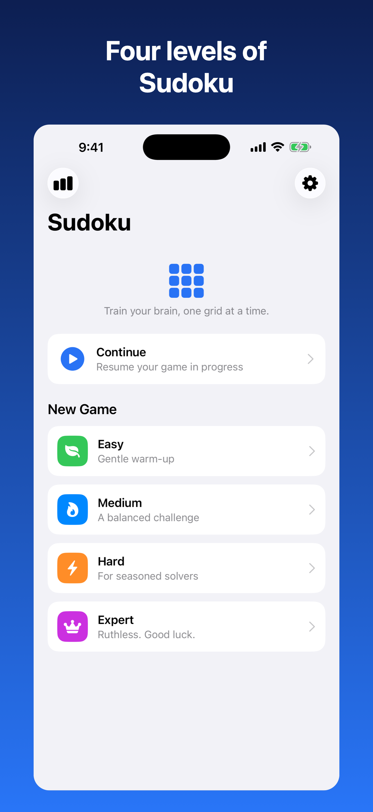
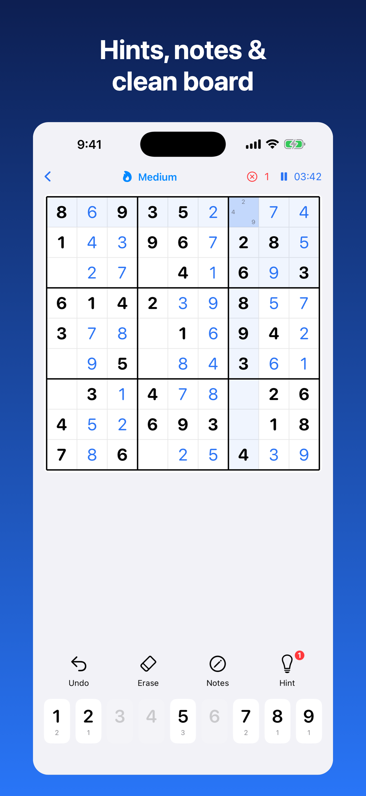
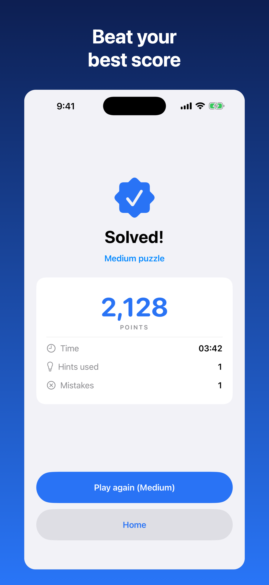

<div align="center">

# Tertiary Sudoku

[](https://www.apple.com/ios/)
[](https://swift.org)
[](https://developer.apple.com/xcode/swiftui/)
[](https://github.com/yonaskolb/XcodeGen)
[](#)
[](https://apps.apple.com/us/app/tertiary-sudoku/id6779973622)
[](#license)

**A clean, offline, native iPhone Sudoku game — unlimited unique puzzles, four difficulty levels, smart hints, and local high scores.**

<a href="https://apps.apple.com/us/app/tertiary-sudoku/id6779973622"></a>

[Download on the App Store](https://apps.apple.com/us/app/tertiary-sudoku/id6779973622) · [Report Bug](https://github.com/alfredang/sudokuapp/issues) · [Request Feature](https://github.com/alfredang/sudokuapp/issues)

</div>

## Screenshots

| Home | In‑game | Solved |
|:---:|:---:|:---:|
|  |  |  |

## About

Tertiary Sudoku is a native **SwiftUI** number‑puzzle game for iPhone, built to ship on the
App Store. Every puzzle is generated **on‑device** with a mathematically **guaranteed unique
solution**, so you never run out and never see the same grid twice. It's 100% offline and
private — scores and history never leave your phone. Rated **18+**.

> Inspired by the Android [sudoku-mobile](https://github.com/alfredang/sudoku-mobile) app,
> rebuilt natively in Swift and adapted for an 18+ audience.

### Key features

| Feature | Description |
|---|---|
| 🎚️ Four difficulty levels | Easy / Medium / Hard / Expert (45 / 36 / 30 / 25 starting clues) |
| 💡 Smart hints | Reveal the correct value for any cell on request — each hint affects your score |
| ✏️ Pencil notes | Candidate marks with optional auto‑cleanup of peers |
| 🎯 Highlighting | Conflict and same‑number highlighting, both toggleable |
| 🏆 Scoring & history | Base points + speed bonus − hint/mistake penalties; best times per difficulty |
| 💾 Local storage | Scores, history and an in‑progress game saved on‑device (`UserDefaults`) |
| ⏸️ Resume | Quit any time and pick up where you left off |
| 🔞 18+ age gate | One‑time age confirmation on first launch |
| 🔒 Private & offline | No network, no permissions, no tracking |

## Tech Stack

| Category | Technology |
|---|---|
| Language | Swift 5 |
| UI | SwiftUI (iOS 16+, iPhone, portrait) |
| Architecture | Lightweight MVVM (single `GameViewModel`) |
| Puzzle engine | Pure‑Swift generator/solver (randomised MRV backtracking + uniqueness check) |
| Persistence | `UserDefaults` (JSON) — on‑device only |
| Project generation | [XcodeGen](https://github.com/yonaskolb/XcodeGen) (`project.yml`) |
| Dependencies | None |

## Architecture

```
┌──────────────────────────── SwiftUI Views ────────────────────────────┐
│  RootView → AgeGate · Home · Game (Board + NumberPad) · Completion      │
│                         · Stats · Settings                              │
└───────────────────────────────┬────────────────────────────────────────┘
                                 │  @EnvironmentObject
                       ┌─────────▼──────────┐
                       │   GameViewModel    │   board state · timer · hints
                       │  (@MainActor OO)   │   undo · settings · 18+ gate
                       └───┬───────────┬────┘
              ┌────────────▼──┐   ┌────▼─────────────┐
              │  SudokuEngine │   │   ScoreStore     │
              │ generate/solve│   │ UserDefaults JSON│
              │  uniqueness   │   │ sessions+resume  │
              └───────────────┘   └──────────────────┘
```

## Project Structure

```
sudokuapp/
├── project.yml                 # XcodeGen project definition
├── SudokuApp/
│   ├── App/                    # @main entry point
│   ├── Models/                 # Difficulty, GameSession, navigation
│   ├── Engine/                 # SudokuEngine (generate / solve / uniqueness)
│   ├── Utilities/              # ScoreCalculator, ScoreStore (persistence)
│   ├── ViewModels/             # GameViewModel
│   ├── Views/                  # Root, AgeGate, Home, Game, Board, Completion, Stats, Settings
│   ├── Resources/              # Assets.xcassets (icon + accent colour)
│   └── Support/                # Info.plist, PrivacyInfo.xcprivacy
├── screenshots/                # raw captures + framed App Store images
├── scripts/                    # frame_screenshot.swift
└── .claude/skills/             # app-store-submission + iOS design guideline skills
```

## Getting Started

### Prerequisites

- macOS with **Xcode 16+**
- [XcodeGen](https://github.com/yonaskolb/XcodeGen): `brew install xcodegen`

### Build & run

```bash
git clone https://github.com/alfredang/sudokuapp.git
cd sudokuapp
xcodegen generate            # creates SudokuApp.xcodeproj from project.yml
open SudokuApp.xcodeproj      # ⌘R to run on a simulator or device
```

Or from the command line:

```bash
xcodebuild -project SudokuApp.xcodeproj -scheme SudokuApp \
  -configuration Debug -sdk iphonesimulator \
  -destination 'platform=iOS Simulator,name=iPhone 17' build
```

> Always edit `project.yml` (not the generated `.xcodeproj`) and re‑run `xcodegen generate`
> after adding or removing files.

## App Store Submission

This repo bundles an **App Store submission skill** (`.claude/skills/app-store-submission/`)
that drives archiving, build upload, metadata, screenshots, and review submission via the
App Store Connect API + Xcode CLI. See [`STORE_LISTING.md`](STORE_LISTING.md) for the full
listing copy and asset locations. The 18+ age rating and App Privacy label are set in the
App Store Connect UI (no public API).

## Privacy

100% offline. Scores and game history are stored on‑device in `UserDefaults` and are never
transmitted. See [`PrivacyInfo.xcprivacy`](SudokuApp/Support/PrivacyInfo.xcprivacy).

## License

Released under the MIT License.

## Developed By

**Tertiary Infotech Pte. Ltd.**

## Acknowledgements

- [XcodeGen](https://github.com/yonaskolb/XcodeGen) for project generation
- Apple's [Human Interface Guidelines](https://developer.apple.com/design/human-interface-guidelines/) and SwiftUI
- Original Android concept: [sudoku-mobile](https://github.com/alfredang/sudoku-mobile)

---

<div align="center">

⭐ If you find this useful, give it a star!

</div>
